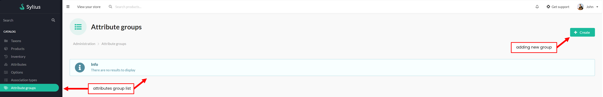
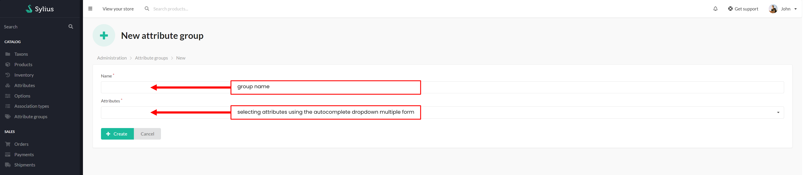
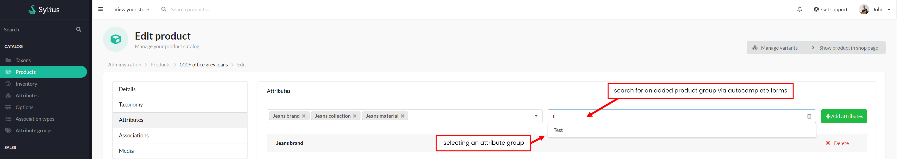
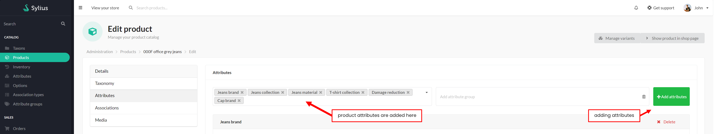
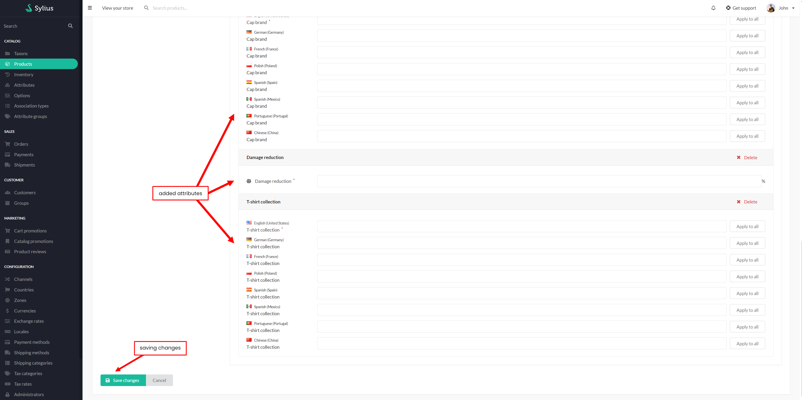

# Functionalities

---
## Introduction

---
SyliusProductAttributeGroupsPlugin allows you to group your attributes and attach them grouped to the products.

## Usage
If you need to add multiple sets of the same attributes to your products, you do not need to add them individually each time.
It is possible to create an attribute group, which allows attributes from the group to be added to a product in one click.

---
### Adding attribute group

Selectable list of attribute groups:

    

 

Adding new group:

    

 

### Adding an attribute group to a product
Once a group of attributes has been added, go to the "attributes" tab on the add or edit product page.  
Then select the relevant product group.

    

 

Group attribute tags should appear in the form on the left. When you click on the 'Add attributes' button, new forms will be added.

    

 

Now it is just a matter of completing the forms and saving the changes.

    

 
